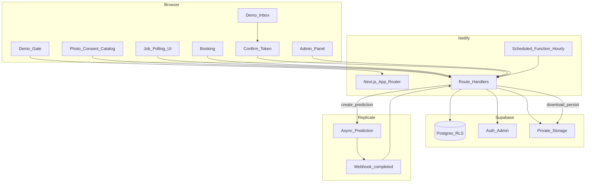

# Architecture

## Diagrama

## Capas

- **UI:** App Router pages/components (Tailwind, shadcn, Motion).
- **Application:** use-cases (createJob, handleWebhook, proposeBooking, confirmToken, expireDue).
- **Domain:** state machine, duration formula, overlap rules, errors tipados.
- **Infrastructure:** Supabase, Replicate client, storage, crypto tokens, IP hash.

## Generación IA (flujo principal)

1. `POST /api/ai/jobs` valida sesión demo, consent, límites, archivos.
2. Inserta `ai_jobs` `QUEUED`.
3. Crea prediction async en Replicate con webhook `completed`.
4. Guarda `external_prediction_id`; responde `{ jobId }`.
5. Cliente solo hace poll a `GET /api/ai/jobs/[jobId]` (backoff).
6. Webhook verifica firma + skew temporal; actualiza job idempotentemente; descarga output; persiste en Storage; `SUCCEEDED` / `FAILED`.
7. Polling a Replicate: **solo** recuperación administrativa, no UX principal.

**No** usar Netlify Background Function como mecanismo principal.

## Propuesta / confirmación (transaccional)

Aprobar o proponer (una TX):

1. Lock/check intervalo  
2. Validar libre  
3. Actualizar fechas/duración  
4. Cambiar estado  
5. Invalidar tokens previos  
6. Crear token (guardar hash)  
7. `booking_events`  
8. Mensaje Demo Inbox  
9. Commit  

Confirmación del cliente: re-valida intervalo en TX; marca token usado; idempotente.

## Tiempo

- Persistencia: `timestamptz` UTC.
- Reglas de disponibilidad y UI: `Europe/Madrid` (incluye DST).
- Documentar en UI “hora de Madrid”.

## Email

Contrato interno `NotificationPort` con implementación `DemoInboxAdapter` en v1; `ResendAdapter` futuro (ADR).
