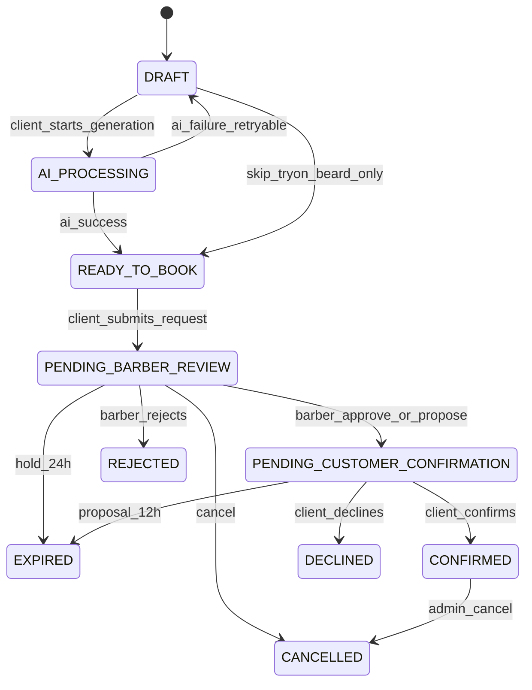

# State machine — booking_requests

## Estados

`DRAFT` · `AI_PROCESSING` · `READY_TO_BOOK` · `PENDING_BARBER_REVIEW` · `PENDING_CUSTOMER_CONFIRMATION` · `CONFIRMED` · `DECLINED` · `REJECTED` · `EXPIRED` · `CANCELLED`

Estados que **bloquean intervalo** (hold o definitivo): `PENDING_BARBER_REVIEW`, `PENDING_CUSTOMER_CONFIRMATION`, `CONFIRMED`.

## Diagrama

## Transiciones válidas (actor)

| Desde | Hacia | Actor | Notas |
|-------|-------|-------|-------|
| DRAFT | AI_PROCESSING | client/system | Crea `ai_jobs` QUEUED |
| AI_PROCESSING | READY_TO_BOOK | webhook/system | Job SUCCEEDED + result path |
| AI_PROCESSING | DRAFT | system | Job FAILED; cliente puede reintentar |
| DRAFT | READY_TO_BOOK | client | Solo servicio sin try-on |
| READY_TO_BOOK | PENDING_BARBER_REVIEW | client | Hold 24h; overlap check |
| PENDING_BARBER_REVIEW | PENDING_CUSTOMER_CONFIRMATION | barber | Transacción propuesta; token nuevo; hold 12h |
| PENDING_BARBER_REVIEW | REJECTED | barber | Libera intervalo |
| PENDING_BARBER_REVIEW | EXPIRED | system | Expire op; libera |
| PENDING_BARBER_REVIEW | CANCELLED | admin/client* | Libera (*si se habilita cancel cliente) |
| PENDING_CUSTOMER_CONFIRMATION | CONFIRMED | client (token) | Re-check overlap en TX |
| PENDING_CUSTOMER_CONFIRMATION | DECLINED | client (token) | Libera |
| PENDING_CUSTOMER_CONFIRMATION | EXPIRED | system | Libera; invalida token |
| CONFIRMED | CANCELLED | admin | Libera |

Cualquier otra transición → error de dominio tipado. Validación **solo backend**.

## ai_jobs (sub-máquina)

`QUEUED` → `RUNNING` → `SUCCEEDED` | `FAILED`  
Retry desde FAILED/QUEUED vía `POST .../retry` respetando límites.

## Eventos

Cada transición escribe `booking_events` (append-only): actor, from, to, metadata segura (sin PII/fotos).
